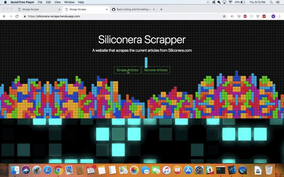
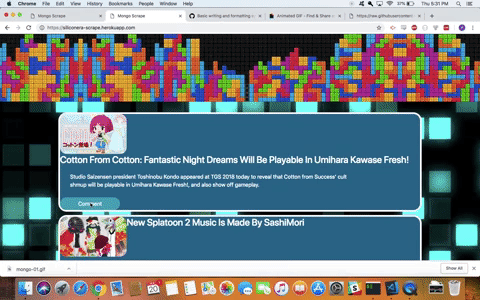
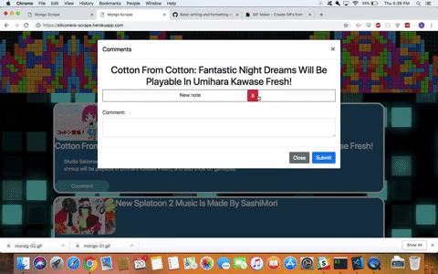

# Mongo-Scrape

https://siliconera-scrape.herokuapp.com/

http://www.siliconera.com/

## Overview

This is a website that scrapes the articles from the main page of siliconera.com, a video game news website. You can also create comments for each article.

## Instructions

* In order to scrape the articles, you must click on the "Scrape Articles" button. The button will on scrape duplicates and will update the list with any new articles. If you want to start from scratch, you can click on the "Remove Articles" button to clear the list. 

* To comment on a scraped article, click on the "Comment" button and a modal will popup with any other comments made before. Type in a comment and hit submit, and when you go back to the modal you should see the new comment.

* To delete a comment, just click on the red X next to it and when you go back to the modal, it should be removed. 

## Technologies Used

This app used Cheerio, Express, Mongo, Mongoose, Handlebars, and Request. 

